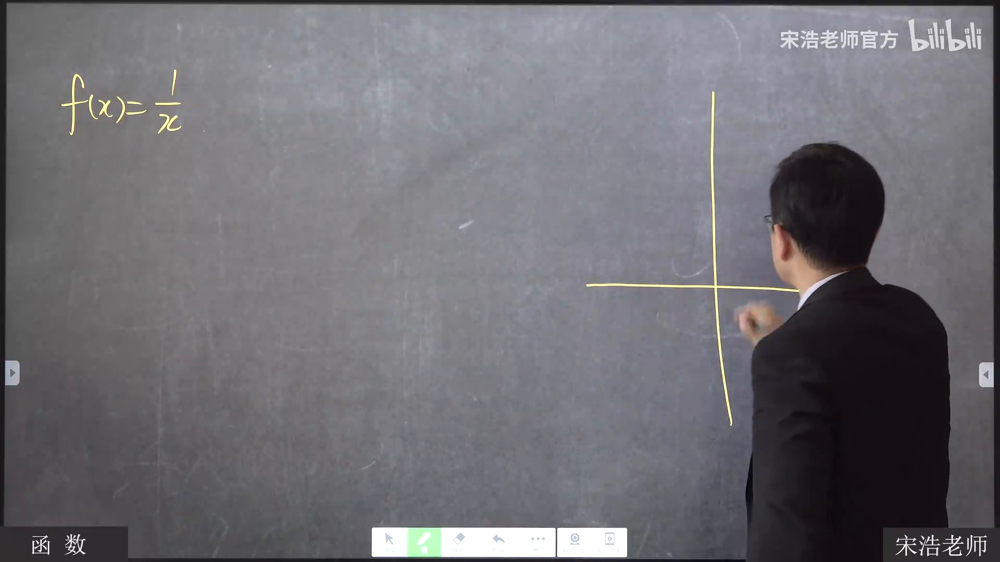
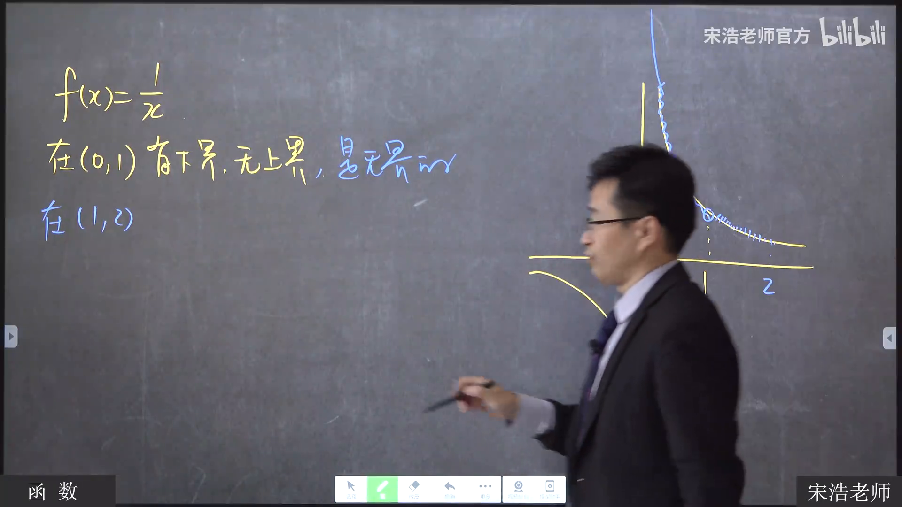
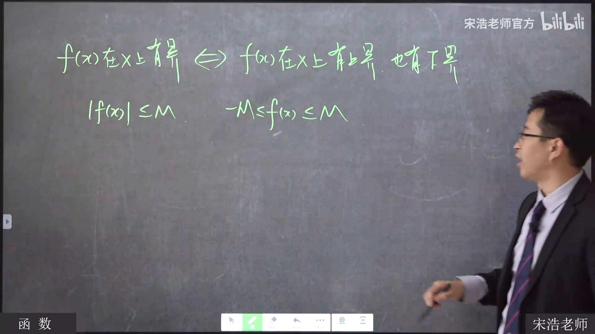
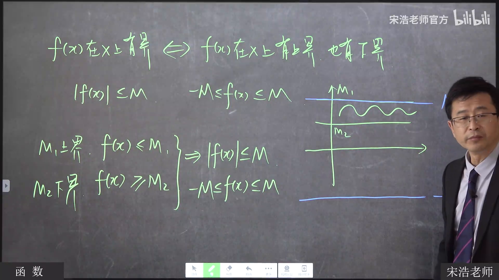
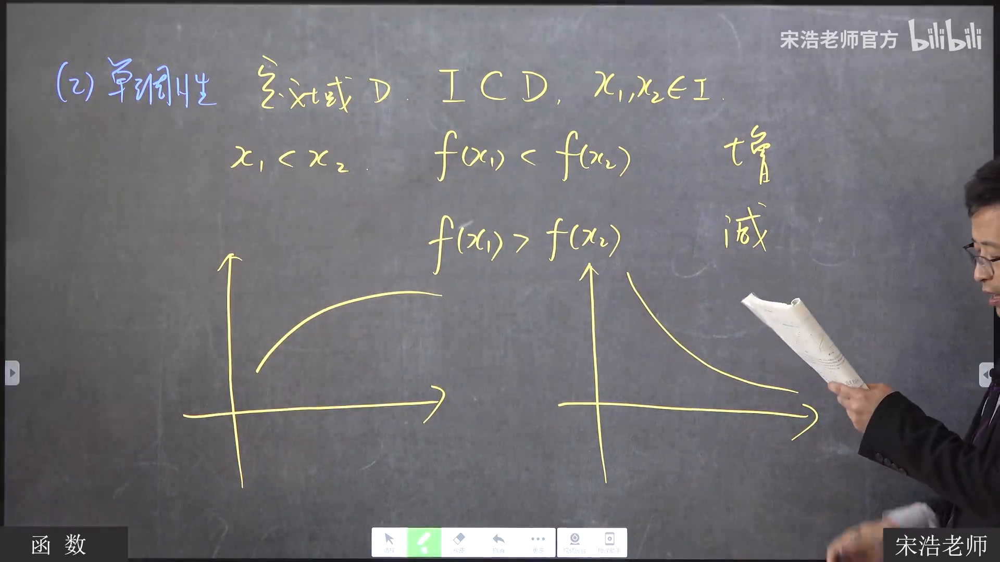
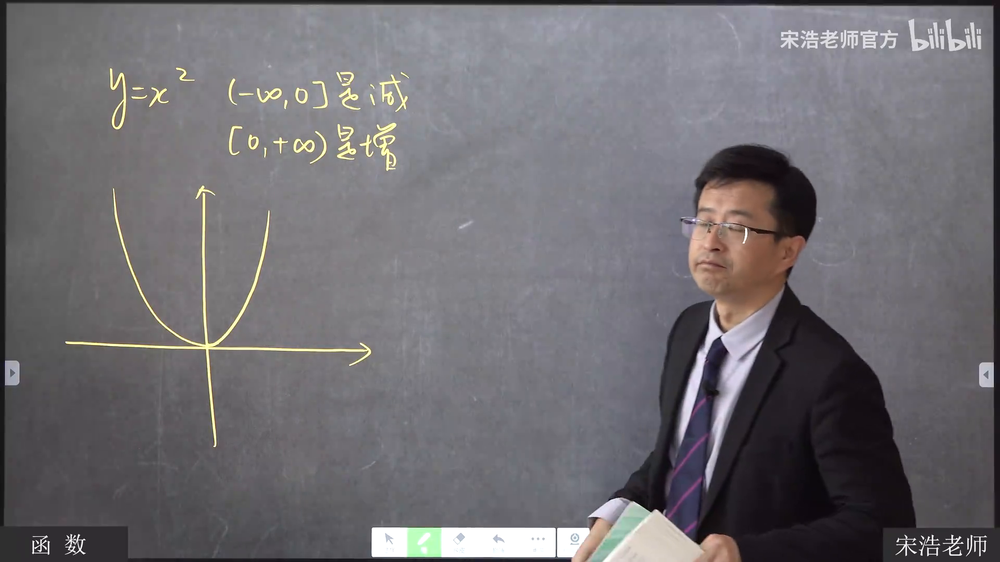
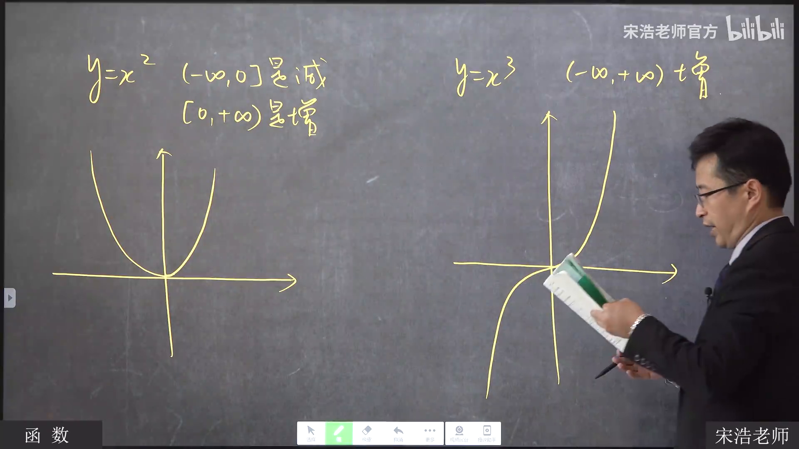
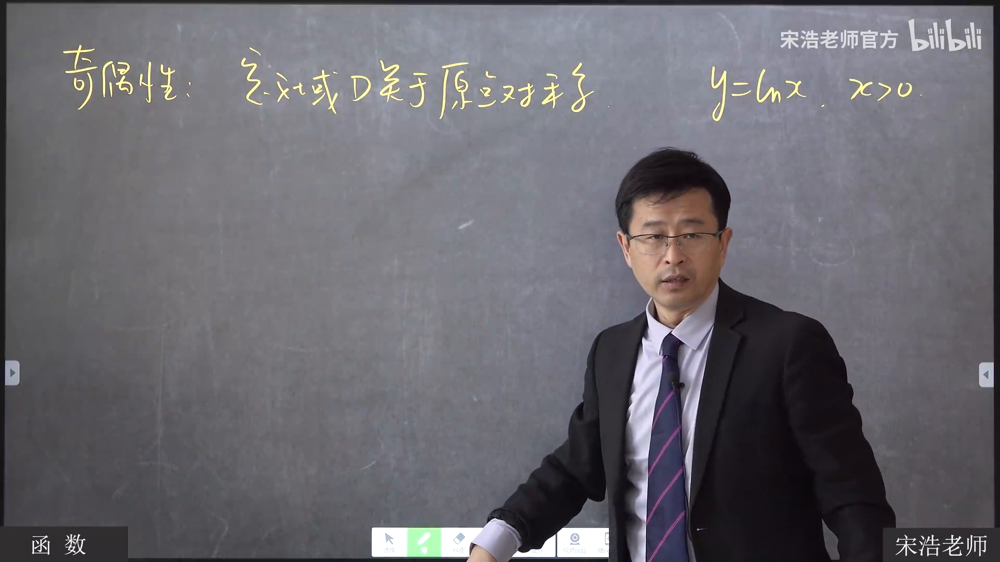
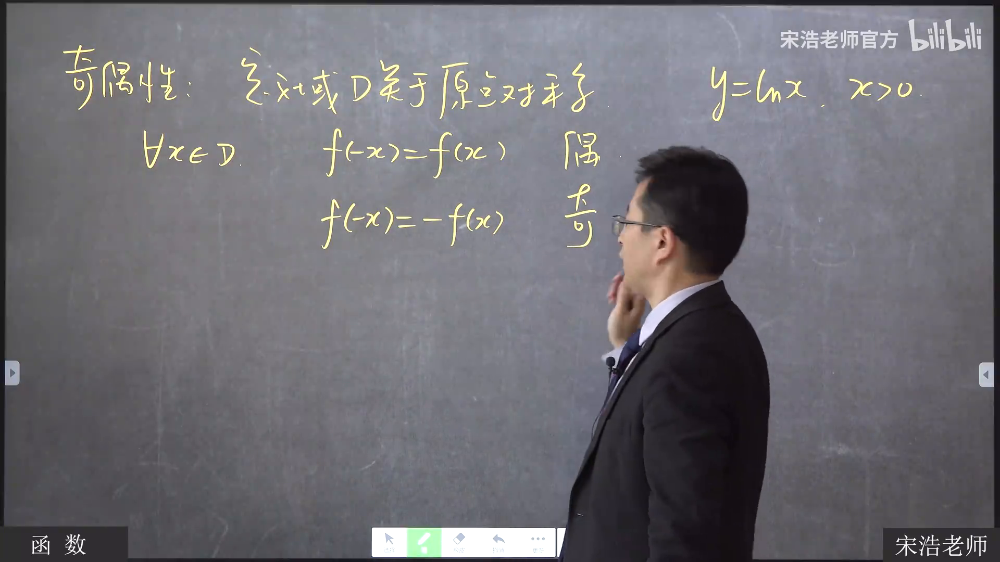
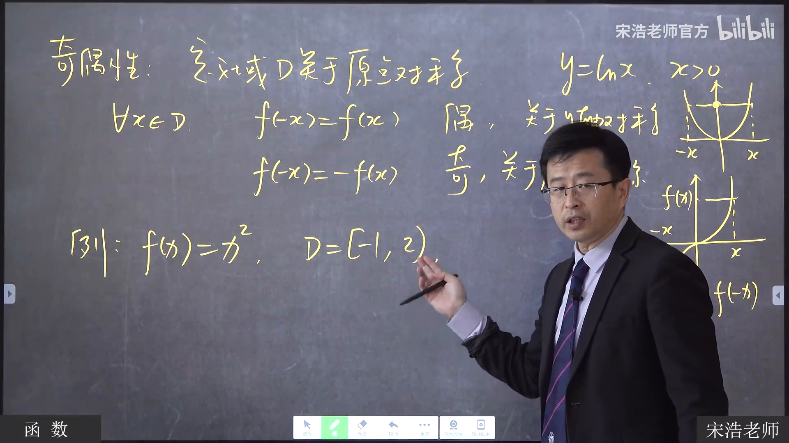

# 函数的有界性、单调性与奇偶性

**宋浩《高等数学》2.0，第 3 集 · 20:00–35:00 试读版**
[打开原视频](https://www.bilibili.com/video/BV1CAxaeHEeH?p=3&t=1200)

这段课从有界性的例子讲到单调性，再用定义域说明判断奇偶性时容易忽略的条件。20:00 时上一个“无界”例子的板书尚在，因此本篇从随后写出的 $f(x)=1/x$ 开始。

## 一、同一个函数，在不同区间上可能有不同的有界性

老师先写下

$$
f(x)=\frac{1}{x}.
$$

*20:25 · [回到原视频](https://www.bilibili.com/video/BV1CAxaeHEeH?p=3&t=1225)*

在 $(0,1)$ 上，它有下界、没有上界；换到 $(1,2)$，它既有上界，也有下界。画面中的曲线相同，变的是所考察的区间。

*21:55 · [回到原视频](https://www.bilibili.com/video/BV1CAxaeHEeH?p=3&t=1315)*

随后，老师把“有界”与“同时有上界、下界”连起来。绝对值界可以写成双边不等式：

$$
|f(x)|\le M\quad\Longleftrightarrow\quad -M\le f(x)\le M.
$$

*23:15 · [回到原视频](https://www.bilibili.com/video/BV1CAxaeHEeH?p=3&t=1395)*

反过来，课堂先设 $M_1$ 是上界、$M_2$ 是下界，再画出包住函数图像的两条水平线。板书呈现了 $f(x)\le M_1$、$f(x)\ge M_2$ 与最终的 $|f(x)|\le M$；但没有明确写出统一的 $M$ 如何选取。本篇保留这一步的画面，不替老师补一条未写出的公式。

*25:10 · [回到原视频](https://www.bilibili.com/video/BV1CAxaeHEeH?p=3&t=1510)*

## 二、单调性要连同区间一起说

设 $I\subset D$，在 $I$ 中取 $x_1<x_2$。老师用函数值的先后关系区分增、减：

$$
\begin{aligned}
f(x_1)<f(x_2)&\quad\text{对应递增},\\
f(x_1)>f(x_2)&\quad\text{对应递减}.
\end{aligned}
$$

*27:45 · [回到原视频](https://www.bilibili.com/video/BV1CAxaeHEeH?p=3&t=1665)*

第一个例子是 $y=x^2$。板书分别把两侧写为

$$
(-\infty,0]\text{ 上递减},\qquad [0,+\infty)\text{ 上递增}.
$$

*28:30 · [回到原视频](https://www.bilibili.com/video/BV1CAxaeHEeH?p=3&t=1710)*

两个区间都写了端点 $0$。老师随后用“体重先减后增的转折日”作类比，说明转折点可以同时归入两段；讨论的是各个区间内的变化方向。

接着是 $y=x^3$。它的图像一路上升，老师把递增范围写为 $(-\infty,+\infty)$，与需要分段的 $x^2$ 对照。

*30:55 · [回到原视频](https://www.bilibili.com/video/BV1CAxaeHEeH?p=3&t=1855)*

## 三、判断奇偶性，先看定义域

老师先写出一个不能直接套奇偶性等式的例子：

$$
y=\ln x,\qquad x>0.
$$

它的定义域不关于原点对称，因此课堂将它判为非奇非偶。只盯着解析式、跳过定义域，会在这一步出错。

*31:45 · [回到原视频](https://www.bilibili.com/video/BV1CAxaeHEeH?p=3&t=1905)*

在定义域 $D$ 关于原点对称的前提下，板书给出两种关系：

$$
\begin{aligned}
f(-x)&=f(x) &&\text{偶函数},\\
f(-x)&=-f(x) &&\text{奇函数}.
\end{aligned}
$$

*32:30 · [回到原视频](https://www.bilibili.com/video/BV1CAxaeHEeH?p=3&t=1950)*

最后，老师故意把熟悉的 $x^2$ 限制到一个不对称的定义域：

$$
f(x)=x^2,\qquad D=[-1,2).
$$

这时定义域不关于原点对称，课堂结论是**非奇非偶**。同一个解析式换了定义域，奇偶性判断也会改变。

*34:40 · [回到原视频](https://www.bilibili.com/video/BV1CAxaeHEeH?p=3&t=2080)*

---

本篇只覆盖 20:00–35:00，依据该段板书和附近字幕人工校准；它是公式识别方案的试读成品，不代表一键视觉模型已经完成自动识别。[查看试验记录](../../../docs/formula-pilot-bv1caxaeheeh-p3-20-35.md)。
